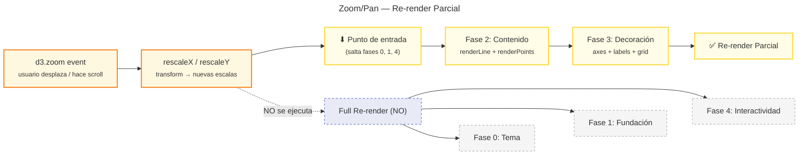

# visc-line: Especificaciones y Decisiones de Diseño

## Propósito

Librería de componentes para gráficos de líneas basada en D3.js. Abstrae la complejidad de D3 detrás de una API declarativa yfluente, permitiendo renderizar gráficos de línea configurables mediante un sistema de temas basado en CSS custom properties.

---

## 1. Arquitectura General

### 1.1 Organización en Capas

La librería sigue una **arquitectura en capas** donde cada nivel tiene responsabilidades claras:

| Capa | Responsabilidad | Ubicación |
|------|-----------------|-----------|
| **API Pública** | Builder pattern con métodos fluent | `chart/` |
| **Orquestación** | Coordinar renderizado, estado y ciclo de vida | `chart/` |
| **Renderizado** | Crear/actualizar elementos SVG | `components/` |
| **Transformación** | Datos → escalas, layout, procesamiento | `services/` |
| **Interactividad** | Tooltip, zoom/pan (efectos secundarios) | `interactivity/` |
| **Tema** | Tokens visuales y CSS custom properties | `themes/` |
| **Tipos** | Interfaces TypeScript | `types/` |
| **Utilidades** | Funciones helpers reutilizables | `utils/` |

### 1.2 Decisión: Builder Pattern + Render Loop Centralizado

**Opción elegida**: `createChart()` retorna una instancia con métodos fluent (`.withAxes()`, `.withTooltip()`, etc.) que mutan un estado interno y disparan re-render.

**Alternativa considerada**: Componer renderizadores directamente.

**Razón de la elección**:
- Permite configuración incremental y legible
- El estado centralizado facilita la idempotencia
- El re-render automático tras cada `.with*()` simplifica el uso

**Trade-off**: La mutación de estado puede dificultar el debugging; se mitiga con `ChartState` tipado.

### 1.3 Decisión: Rendering Procedimental con D3 Upsert

**Opción elegida**: Cada componente es una función pura que recibe estado y realiza manipulación directa del DOM via D3.

**Alternativa considerada**: Virtual DOM o declarative reconciler.

**Razón**: D3 ya tiene un modelo de enter/update/exit optimizado para SVG. Wrappear el reconciler de D3 habría añadido complejidad sin beneficio.

---

## 2. Flujo de Renderizado (Secuencia Fija)

El renderizado sigue una **secuencia obligatoria**. Reordenar o saltar pasos rompe las dimensiones porque cada paso depende del DOM creado por el paso anterior (SVG → bounds → content → elementos dentro de content).

### 2.1 Ciclo de Renderizado Completo

```mermaid
---
title: Ciclo de Renderizado — visc-line
---
flowchart TB
    %% ---- Classes ----
    classDef trigger fill:#e8eaf6,stroke:#3f51b5,stroke-width:2px
    classDef pre fill:#fff3e0,stroke:#fb8c00,stroke-width:2px
    classDef foundation fill:#e3f2fd,stroke:#1e88e5,stroke-width:2px
    classDef core fill:#e8f5e9,stroke:#43a047,stroke-width:2px
    classDef decor fill:#f3e5f5,stroke:#8e24aa,stroke-width:2px
    classDef interact fill:#fce4ec,stroke:#e53935,stroke-width:2px
    classDef decision fill:#f5f5f5,stroke:#9e9e9e,stroke-width:1px,stroke-dasharray: 4
    classDef cleanup fill:#ffebee,stroke:#d32f2f,stroke-width:1px
    classDef partial fill:#fffde7,stroke:#fdd835,stroke-width:2px,stroke-dasharray: 6 3
    classDef zoomEvent fill:#fff8e1,stroke:#f57f17,stroke-width:2px

    %% ---- Punto de entrada ----
    TRIGGER{"¿Qué dispara el render?"}:::trigger

    INIT["createChart() inicial"]:::trigger
    WITH["Método .with*() llamado"]:::trigger
    RESIZE["ResizeObserver dispara"]:::trigger

    TRIGGER --> INIT
    TRIGGER --> WITH
    TRIGGER --> RESIZE

    INIT -->|"RUTA A: FULL RE-RENDER"| CLEANUP
    WITH --->|"RUTA A: FULL RE-RENDER"| CLEANUP
    RESIZE --->|"RUTA A: FULL RE-RENDER"| CLEANUP

    CLEANUP["clearOptionalNodes()<br/><small>Elimina DOM de features<br/>que ya no están activas</small>"]:::cleanup

    %% ---- FASE 0: Tema ----
    subgraph PHASE0["FASE 0 — Tema (antes del SVG)"]
        direction TB
        THEME["applyThemeCssVars(container, resolvedTheme)<br/><small>Escribe --vl-* en el contenedor</small>"]:::pre
    end

    CLEANUP --> THEME

    %% ---- FASE 1: Fundación ----
    subgraph PHASE1["FASE 1 — Fundación SVG"]
        direction TB
        SVG["renderSVG(container)<br/><small>Crea/actualiza &lt;svg&gt;<br/>Dimensiones del contenedor</small>"]:::foundation
        BOUNDS["renderBoundsGroup(svg, margins)<br/><small>Crea &lt;g class='bounds'&gt;<br/>translate(marginLeft, marginTop)</small>"]:::foundation
        CONTENT["renderContentGroup(bounds, svg, clipPath)<br/><small>Crea &lt;g class='content'&gt;<br/>con &lt;clipPath&gt; aplicado</small>"]:::foundation
    end

    THEME --> SVG --> BOUNDS --> CONTENT

    %% ---- Punto de entrada para re-render parcial por zoom ----
    ZOOM_ENTRY["⬇︎ Punto de entrada<br/>re-render parcial"]:::partial

    %% ---- FASE 2: Contenido ----
    subgraph PHASE2["FASE 2 — Contenido (dentro de content)"]
        LINE["renderLine(content, series, scales)<br/><small>&lt;path&gt; por serie<br/>d3.line().curve()</small>"]:::core
        POINTS_GATE{"hasPoints?"}:::decision
        POINTS["renderPoints(content, series, scales)<br/><small>&lt;circle&gt; por punto</small>"]:::core
    end

    CONTENT --> LINE
    ZOOM_ENTRY --> LINE
    LINE --> POINTS_GATE
    POINTS_GATE -->|Sí| POINTS
    POINTS_GATE -->|No| SKIP_POINTS

    SKIP_POINTS["Se salta"]:::decision

    %% ---- FASE 3: Decoración ----
    subgraph PHASE3["FASE 3 — Decoración (svg y bounds)"]
        TITLE_GATE{"hasTitle?"}:::decision
        TITLE["renderTitle(svg, options)<br/><small>&lt;text class='chart-title'&gt;</small>"]:::decor
        XAXIS_GATE{"hasAxes?"}:::decision
        XAXIS["renderXAxis(bounds)<br/><small>D3 axisBottom</small>"]:::decor
        YAXIS["renderYAxis(bounds)<br/><small>D3 axisLeft</small>"]:::decor
        XLABEL_GATE{"xLabel?"}:::decision
        YLABEL_GATE{"yLabel?"}:::decision
        XLABEL["renderXAxisLabel(svg)"]:::decor
        YLABEL["renderYAxisLabel(svg)"]:::decor
        GRID_GATE{"hasGrid?"}:::decision
        XGRID["renderXGrid(content)<br/><small>&lt;line class='grid-x'&gt;</small>"]:::decor
        YGRID["renderYGrid(content)<br/><small>&lt;line class='grid-y'&gt;</small>"]:::decor
    end

    POINTS --> TITLE_GATE
    SKIP_POINTS --> TITLE_GATE
    TITLE_GATE -->|Sí| TITLE
    TITLE_GATE -->|No| SKIP_TITLE
    TITLE --> XAXIS_GATE
    SKIP_TITLE["Se salta"]:::decision --> XAXIS_GATE
    XAXIS_GATE -->|Sí| XAXIS
    XAXIS_GATE -->|No| SKIP_AXES
    XAXIS --> YAXIS
    YAXIS --> XLABEL_GATE
    SKIP_AXES["Se salta"]:::decision --> GRID_GATE
    XLABEL_GATE -->|Sí| XLABEL
    XLABEL_GATE -->|No| SKIP_XLABEL
    XLABEL --> YLABEL_GATE
    SKIP_XLABEL["Se salta"]:::decision --> YLABEL_GATE
    YLABEL_GATE -->|Sí| YLABEL
    YLABEL_GATE -->|No| SKIP_YLABEL
    YLABEL --> GRID_GATE
    SKIP_YLABEL["Se salta"]:::decision --> GRID_GATE
    GRID_GATE -->|Sí| XGRID
    GRID_GATE -->|No| SKIP_GRID
    XGRID --> YGRID
    YGRID --> TOOLTIP_CHECK
    SKIP_GRID["Se salta"]:::decision --> TOOLTIP_CHECK

    %% ---- Checkpoint post-render ----
    TOOLTIP_CHECK["Interactividad<br/>ya configurada"]:::decision

    %% ---- FASE 4: Interactividad ----
    subgraph PHASE4["FASE 4 — Interactividad (post-render, setup único)"]
        TOOLTIP_GATE{"hasTooltip?"}:::decision
        TOOLTIP["addTooltip(bounds)<br/><small>tipviz + cursor + dots</small>"]:::interact
        ZOOM_GATE{"hasZoomPan?"}:::decision
        ZOOM["addZoomPan(svg)<br/><small>Configura d3.zoom<br/>NO renderiza aún</small>"]:::interact
        ZOOM_REGION["<b>⚠ DURANTE ZOOM (evento)</b>"]:::zoomEvent
        RESCALE["rescaleX / rescaleY<br/><small>Nuevas escalas desde<br/>d3.event.transform</small>"]:::zoomEvent
        PARTIAL["Re-render parcial<br/><small>FASES 2 + 3 (CONTENIDO + DECORACIÓN)<br/>sin cleanup, tema ni fundación</small>"]:::partial
    end

    YGRID --> TOOLTIP_CHECK
    TOOLTIP_CHECK -->|setup inicial| TOOLTIP_GATE
    TOOLTIP_GATE -->|Sí| TOOLTIP
    TOOLTIP_GATE -->|No| SKIP_TT
    TOOLTIP --> ZOOM_GATE
    SKIP_TT["Se salta"]:::decision --> ZOOM_GATE
    ZOOM_GATE -->|Sí| ZOOM
    ZOOM_GATE -->|No| DONE
    ZOOM --> DONE

    %% ---- Ciclo de zoom (evento en runtime) ----
    ZOOM -.->|"usuario hace zoom →<br/>dispara evento"| ZOOM_REGION
    ZOOM_REGION --> RESCALE
    RESCALE --> PARTIAL
    PARTIAL -.->|"entra directo a FASE 2"| ZOOM_ENTRY

    DONE["✅ Render Completo"]:::trigger
    DONE_PARTIAL["✅ Re-render Parcial<br/>Completo"]:::partial

    YGRID --> DONE_PARTIAL

    %% ---- Notas de diseño ----
    N1["🧠 ClipPath en content, NO en bounds<br/>Los ejes quedan fuera del recorte<br/>→ visibles durante zoom/pan"]:::decision
    N2["🧠 Cada render es idempotente<br/>D3 .data().join() upsert<br/>→ mismos datos = mismo DOM"]:::decision
    N3["🧠 Zoom NO usa re-render completo<br/>→ rescalea + re-render contenido y ejes<br/>→ fundación SVG (fase 1) intacta"]:::decision
    N4["🧠 Interactividad se configura UNA VEZ<br/>Zoom posterior NO re-ejecuta<br/>addTooltip ni addZoomPan"]:::decision

    CONTENT -.- N1
    POINTS -.- N2
    PARTIAL -.- N3
    TOOLTIP_CHECK -.- N4
```



### 2.2 Fases del Ciclo

| Fase | Propósito | Contiene |
|------|-----------|----------|
| **0. Tema** | Preparar el contexto visual antes de cualquier DOM | `applyThemeCssVars()` |
| **1. Fundación** | Construir la jerarquía SVG estructural | `renderSVG`, `renderBoundsGroup`, `renderContentGroup` |
| **2. Contenido** | Renderizar la visualización de datos (clipado) | `renderLine`, `renderPoints` |
| **3. Decoración** | Añadir elementos de contexto (sin clip) | `renderTitle`, `renderXAxis`, `renderYAxis`, `renderXGrid`, `renderYGrid`, labels |
| **4. Interactividad** | Habilitar manipulación del usuario | `addTooltip`, `addZoomPan` |

### 2.3 Feature Flags (Gates de Renderizado)

Cada componente opcional tiene un flag booleano en `ChartState`:

| Flag / Estado | Renderiza | Por defecto |
|---------------|-----------|-------------|
| `hasTitle` | Título | false |
| `hasAxes` | Ejes X + Y | false |
| `hasGrid` | Grid X + Y | false |
| `hasPoints` | Puntos | false |
| `hasTooltip` | Tooltip | false |
| `hasZoomPan` | Zoom/Pan | false |
| `visibleLabels` | Controla qué series se renderizan (no es flag booleano, es un `Set<string>` de labels activas) | Todas las labels |

Los flags se activan al llamar al método fluent correspondiente (`.withTitle()`, `.withAxes()`, etc.). La visibilidad de series se controla mediante `withVisibleSeries(labels)` y `updateVisibleSeries(labels)`, que mutan `state.visibleLabels` y filtran `state.allSeries` para producir `state.currentSeries`.

### 2.4 Decisión: ClipPath en Content, No en Bounds

**Elección**: El `<clipPath>` se aplica al grupo de contenido (línea, puntos, grid), NO al grupo de bounds (ejes).

**Razón**: Los ejes permanecen visibles durante zoom/pan; solo el contenido se recorta.

### 2.5 Decisión: Full Re-render vs. Partial Re-render

**Problema**: Distintos triggers requieren distintos alcances de re-render. No todos los cambios necesitan reconstruir la fundación SVG.

| Trigger | Tipo de re-render | Fases que ejecuta |
|---------|-------------------|-------------------|
| `createChart()` inicial | Full | 0 + 1 + 2 + 3 + 4 |
| `.with*()` (config) | Full | 0 + 1 + 2 + 3 + 4 |
| ResizeObserver | Full | 0 + 1 + 2 + 3 + 4 |
| **Zoom/Pan (evento en runtime)** | **Partial** | **2 + 3 (salta 0, 1, 4)** |

**Ruta A — Full re-render** (init, `.with*()`, resize):
1. `clearOptionalNodes()` — limpia DOM de features desactivadas
2. `applyThemeCssVars()` — re-escribe variables CSS
3. `renderSVG` + `renderBoundsGroup` + `renderContentGroup` — reconstruye fundación
4. `renderLine` + `renderPoints` — renderiza contenido
5. `renderTitle`/`renderXAxis`/`renderYAxis`/labels/grid — decoración
6. `addTooltip` + `addZoomPan` — configura interactividad (solo la primera vez via flag interno)

**Ruta B — Partial re-render** (zoom event):
1. `d3.event.transform.rescaleX/rescaleY` — **nuevas escalas** sin tocar el DOM
2. Entra directo en **Fase 2** (renderLine, renderPoints)
3. Continúa por **Fase 3** (axes, labels, grid — con las nuevas escalas)
4. **No ejecuta** cleanup, tema, fundación, ni interactividad

**Razón**: La fundación SVG (svg, bounds, content, clipPath) no cambia durante zoom. Solo las escalas y lo que depende de ellas (líneas, puntos, ejes, grid). Evitar reconstruir la fundación ahorra trabajo innecesario.

**Alternativa descartada**: Re-render completo en cada evento de zoom.

**Por qué se descartó**: El zoom genera decenas de eventos por segundo. Re-renderizar SVG, bounds, content, cleanup, tema e interactividad en cada frame introduciría latencia perceptible. El re-render parcial es el único camino optimizado para interactividad en tiempo real.

**Alternativa descartada (para full)**: Re-render solo del componente afectado tras un `.with*()`.

**Por qué se descartó**: Es más simple y predecible re-renderizar todo. Los renderizadores son rápidos (D3 upsert con data join) y el costo es despreciable en triggers no-continuos.

#### Ciclo de Zoom/Pan (Partial Re-render)



### 2.6 Decisión: ResizeObserver para Re-render

**Elección**: Cada instancia de chart crea un `ResizeObserver` que dispara re-render completo al cambiar el tamaño del contenedor.

**Alternativa considerada**: Permitir resize manual.

**Razón**: El contenedor puede cambiar por CSS sin conocimiento del chart; es preferible reaccionar automáticamente.

### 2.7 Decisión: Cleanup Previo a Re-render

**Elección**: Antes de cada render, `clearOptionalNodes()` elimina el DOM de features que ya no están activas.

**Razón**: Si un usuario llama `.withTitle("Hola")` y luego descarta el title, los elementos SVG del title deben desaparecer. El cleanup garantiza que el DOM refleje exactamente el estado actual.

---

## 3. Patrón de Rendering Idempotente

### 3.1 Principio: D3 Upsert Pattern

Todos los renderizadores usan el patrón de D3 para evitar duplicación:

```typescript
selection
  .selectAll<DOM_ELEMENT, DATA>("css.class")
  .data([null] or dataArray, keyFunction)
  .join(
    (enter) => append,
    (update) => update,
    (exit) => exit.remove()
  )
```

### 3.2 Clasificación de Renderizadores por Tipo de Dato

| Tipo | Datum | Efecto |
|------|-------|--------|
| **Singleton** | `[null]` | Un solo elemento siempre existe (svg, bounds, axes) |
| **Keyed** | `dataArray con key` | Upsert por clave (líneas por serie, puntos por datum) |
| **Cleanup** | función `clearOptionalNodes()` | Elimina DOM de features deshabilitadas |

### 3.3 Decisión: Seleccionar por Clase CSS, No por Data Attribute

**Elección**: Los renderizadores seleccionan elementos existentes usando selectores de clase CSS (`.chart-line`, `.x-axis`).

**Alternativa considerada**: Data attributes o IDs.

**Razón**: Las clases CSS son el mecanismo natural de D3 para styling y selección; mantenerlas simplifica el código y permite CSS-driven selection.

---

## 4. Sistema de Temas y CSS Custom Properties

### 4.1 Arquitectura de Dos Capas

```text
Theme Object (TypeScript)
    ↓ applyThemeCssVars()
CSS Custom Properties (var(--vl-*))
    ↓ getComputedStyle() cuando D3 requiere números
Valores numéricos para D3 APIs
```

### 4.2 Mapeo de Tokens a Variables CSS

| Categoría | Tokens | Variable CSS |
|-----------|--------|--------------|
| Fondo | `colors.background` | `--vl-background` |
| Paleta | `colors.palette[i]` | `--vl-palette-0`, `--vl-palette-1`, ... |
| Línea | `line.strokeWidth` | `--vl-line-stroke-width` |
| Puntos | `points.radius` | `--vl-point-radius` |
| Ejes | `axis.fontSize` | `--vl-axis-font-size` |
| Grid | `grid.stroke` | `--vl-grid-stroke` |
| Tooltip | `tooltip.background` | `--vl-tooltip-bg` |

### 4.3 Decisión: CSS Variables para Todo,getComputedStyle para D3

**Problema**: D3 axis.tickSize() requiere un número, no un string CSS.

**Solución**:
1. Los renderizadores usan `var(--vl-*)` para atributos SVG (stroke, fill, font-size)
2. Para D3 APIs que requieren números, se usa `getComputedStyle(el).getPropertyValue("--vl-*")` para obtener el valor resuel-to

### 4.4 Decisión: High Contrast Mode como Override Inline

**Elección**: El modo high contrast aplica valores hardcodeados via inline style directamente sobre el contenedor.

**Razón**: No modifica el tema ni las CSS vars; es un override directo que ignora completamente el tema.

---

## 5. Jerarquía de Componentes DOM

### 5.1 Estructura de Anidamiento

```
<svg>
  ├── <defs>
  │   └── <clipPath id="visc-clip-{hash}"/>
  ├── <g class="bounds" transform="translate(marginLeft, marginTop)">
  │   ├── <g class="content" clip-path="url(#...)">
  │   │   ├── <path class="chart-line chart-line--{seriesLabel}"/>
  │   │   ├── <g class="point-series point-series--{label}">
  │   │   │   └── <circle class="point"/>
  │   │   └── <line class="grid-x"/> / <line class="grid-y"/>
  │   ├── <g class="x-axis"/>
  │   ├── <g class="y-axis"/>
  │   ├── <line class="tooltip-cursor"/>
  │   ├── <circle class="tooltip-dot"/>
  │   └── <rect class="mouse-capture"/>
  ├── <text class="chart-title"/>
  ├── <text class="x-axis-label"/>
  ├── <text class="y-axis-label"/>
  ├── <g class="legend">
  │   └── <g class="legend-entry">
  │       ├── <rect class="swatch"/>
  │       └── <text class="legend-label"/>
  └── {tip-viz-tooltip element}
```

### 5.2 Matriz de Responsabilidades de Renderizado

| Componente | Renderiza en | Archivo |
|------------|--------------|---------|
| SVG | container | SVG.mts |
| Bounds Group | svg | boundsGroup.mts |
| Content Group | bounds | contentGroup.mts |
| Line | content | line.mts |
| Points | content | points.mts |
| Title | svg | title.mts |
| X Axis | bounds | xAxis.mts |
| Y Axis | bounds | yAxis.mts |
| Axis Labels | svg | axisLabel.mts |
| Grid | content | grid.mts |
| Legend | svg | legend.mts |
| Tooltip | bounds | tooltip.mts |
| Zoom/Pan | svg | zoomPan.mts |

---

## 6. Flujo de Datos

### 6.1 Pipeline de Transformación

```text
Datos crudos (T[])
    ↓ ChartConfig { data, xSerie, ySeries[] }
    ↓ processAllSeries()
allSeries — ProcessedSeries<T>[] { data filtrado, descriptor de serie }
    ↓ filterSeriesByLabels(visibleLabels) — aplicado en createChart + updateVisibleSeries
currentSeries — ProcessedSeries<T>[] (solo las series con label en visibleLabels)
    ↓ getMultiSeriesExtents()
{ xDomain, yDomain } — calculado sobre currentSeries
    ↓ createScales()
{ xScale, yScale } — con dominio adaptativo según cantidad de series visibles
    ↓ renderers
SVG Elements
```

El estado mantiene dos arrays:

- `state.allSeries`: Todas las series procesadas (no se filtra nunca).
- `state.currentSeries`: Subconjunto visible filtrado por `state.visibleLabels`.

`allSeriesExtents` se calcula una vez al crear/actualizar datos y sirve como dominio
de respaldo cuando múltiples series están visibles o cuando la serie única tiene
pocos datos.

### 6.2 Validación de Datos

**Paso**: `processAllSeries()` filtra valores inválidos:
- `null`, `undefined`
- `NaN`
- `Infinity` / `-Infinity`

**Razón**: D3 no maneja estos valores gracefully; filtrarlos previene errores silenciosos o comportamiento inesperado.

### 6.3 Cálculo de Dominio

**Elección**: El dominio Y se calcula de forma adaptativa según la visibilidad:

- **Múltiples series visibles**: Se usa `allSeriesExtents` (dominio global fijo de todas las series `allSeries`). Esto garantiza que todas las series sean comparables en la misma escala.
- **Una sola serie visible**: Se usa el `yDomain` de la serie actual (`currentSeries`). Esto rescalea el eje para que la serie use todo el espacio disponible.
- **X domain**: Siempre se usa el dominio de `currentSeries` si tiene datos; si no, cae a `allSeriesExtents.xDomain`.

**Alternativa considerada**: Siempre usar dominio global.

**Razón del cambio**: Cuando se muestra una sola serie (ej. "Sales" vs "Amazon"), mantener el dominio global desperdicia espacio vertical y confunde al lector. El rescale automático mejora la UX para datasets con atributos de magnitudes dispares.

**Alternativa considerada**: Siempre rescale por serie visible.

**Razón de rechazo**: Con múltiples series visibles, comparar tendencias requiere que los ejes sean estables. El rescale constante al alternar entre "All Series" y una serie individual produce saltos de eje que son intencionales y deseables solo cuando se aísla una serie.

---

## 7. Sistema de Tipos

### 7.1 Tipos Principales

| Tipo | Propósito |
|------|-----------|
| `ChartConfig<T>` | Input: datos + definiciones de series x/y |
| `ProcessedSeries<T>` | Serie con datos filtrados |
| `SeriesDescriptor<T>` | Accessor + label + overrides de estilo |
| `ChartInstance<T>` | API pública retornada por createChart (incluye `allSeries`, `series` (visible), `withVisibleSeries()`, `updateVisibleSeries()`) |
| `ChartOptions` | Opciones de creación (curve, margins, theme, scale types) |
| `WithAxesOptions` | Configuración de ticks y formato de ejes |
| `WithGridOptions` | flags showX/showY |
| `WithTooltipOptions` | formatX/Y, tooltipHtml, stylesheetUrl |
| `WithZoomPanOptions` | onZoom callback, scaleExtent |
| `WithTitleOptions` | título string |
| `WithLegendOptions` | items de leyenda |
| `Theme` | Objeto completo de tema |
| `ThemeOverride` | Partial profundo de Theme para overrides |
| `Dimensions` | width, height, innerWidth, innerHeight, margins |
| `Margins` | top, right, bottom, left |
| `AnyScale` | Unión de tipos de escala D3 |
| `TickableScale` | Contrato mínimo para axes/grid (domain, ticks) |
| `ScaleType` | "linear" \| "log" \| "pow" \| "time" |
| `CustomContext` | Escape hatch: contexto para callbacks arbitrarios |
| `CurvePreset` | 18 presets de curva como literales string |

### 7.2 Relación Entre Tipos

```text
ChartConfig<T>
    ↓ processAllSeries()
ProcessedSeries<T>[]
    ↓ ChartState (estado interno)
    ↓ + feature flags
RenderContext<T>
    ↓ pasa a cada renderer
```

---

## 8. Abstracciones Configurables vs. Hardcoded

### 8.1 Aspectos Configurables

| Aspecto | Mecanismo de Configuración |
|---------|---------------------------|
| Datos | `ChartConfig<T>` con accessors |
| Curva | `curve: CurveFactory \| CurvePreset` |
| Márgenes | `margins?: Margins` (default predefinido) |
| Tipo de escala X | `xType?: ScaleType` (default: "time") |
| Tema | `theme?: ThemeOverride` (deep-merge) |
| Ticks de ejes | vía `.withAxes()` |
| Grid | flags showX/showY vía `.withGrid()` |
| Puntos | Habilitados vía `.withPoints()` |
| Título | string vía `.withTitle()` |
| Leyenda | items vía `.withLegend()` |
| Tooltip | opciones vía `.withTooltip()` |
| Zoom/Pan | opciones vía `.withZoomPan()` |
| Custom | callbacks arbitrarios vía `.withCustom()` |
| **Visibilidad de series** | **labels vía `.withVisibleSeries()` y `.updateVisibleSeries()`** |
| **Legend interactivo** | **flags `interactive` y `onToggle` vía `.withLegend()`** |

### 8.2 Aspectos Hardcoded

| Aspecto | Valor |
|---------|-------|
| Márgenes default | 50/55/60/70 (top/left/right/bottom) |
| Posición de leyenda | Offset y ancho hardcoded |
| ClipPath | Siempre aplicado a content group |
| Duración de animación | 1000ms |
| Zoom scaleExtent default | [0.5, 32] |
| D3 axis tick count default | 5 |
| High contrast | Valores blacks hardcoded |

---

## 9. Abstracciones para Nuevos Tipos de Gráficos

### 9.1 Contrato Común de Componente Chart

Todo tipo de gráfico en esta familia debería cumplir:

```text
createChart(config) → ChartInstance<T>
ChartInstance<T>
  .withAxes()        → self (opcional)
  .withGrid()        → self (opcional)
  .withTooltip()     → self (opcional)
  .withZoomPan()     → self (opcional)
  .withTitle()       → self (opcional)
  .withLegend()      → self (opcional)
  .withCustom()      → self (opcional)
  .render()          → self
  .destroy()         → void
```

### 9.2 Renderizadores Reutilizables

Estos renderizadores son **independientes del tipo de dato** y pueden reutilizarse:

| Renderer | Reutilizable para |
|-----------|-------------------|
| `renderSVG` | Cualquier gráfico |
| `renderBoundsGroup` | Cualquier gráfico |
| `renderContentGroup` | Cualquier gráfico |
| `renderTitle` | Cualquier gráfico |
| `renderXAxis` / `renderYAxis` | Barras, radar, area, etc. |
| `renderXAxisLabel` / `renderYAxisLabel` | Cualquier gráfico |
| `renderXGrid` / `renderYGrid` | Cualquier gráfico |
| `addTooltip` | Cualquier gráfico |
| `addZoomPan` | Cualquier gráfico |
| `applyThemeCssVars` | Cualquier gráfico |

### 9.3 Renderizadores Específicos de Línea

Estos son **únicos de línea** y requieren reimplementación:

| Renderer | Reimplementar para |
|----------|---------------------|
| `renderLine` | Area chart (añade área bajo la curva) |
| `renderPoints` | Scatter plot, bar chart |

### 9.4 Sistema de Escalas

El servicio de escalas (`services/scales.mts`) define:

```
ScaleType → D3 Scale Factory
```

Para nuevos tipos de gráficos:

- **Barras**: Escala de banda (`scaleBand`) + escala lineal para Y
- **Radar**: `scalePoint` + `scaleLinear` radial
- **Pie/Donut**: `scaleOrdinal` para colores + layout especial
- **Scatter**: Similar a línea pero sin interpolación, con sizing opcional

### 9.5 Sistema de Curvas

`utils/curveMap.mts` proporciona:

```text
CurvePreset (18 presets) → D3 CurveFactory
```

Para **área charts**: Las mismas curvas aplican; solo cambia el generador (de `d3.line()` a `d3.area()`).

---

## 10. Decisiones de Diseño Consolidadas

### 10.1 API

- **Builder pattern** con métodos fluent para configuración incremental
- **Feature flags** en ChartState para gating condicional de renderizado
- **Custom callbacks** como escape hatch para personalización avanzada
- **Visibilidad controlada**: `withVisibleSeries()` / `updateVisibleSeries()` — el consumidor posee el estado, el librería renderiza
- **Legend como event emitter**: La leyenda interactiva emite eventos `onToggle` pero no muta estado interno

### 10.2 Rendering

- **Render loop centralizado** en `chartRender.mts`
- **Secuencia fija obligatoria** de pasos de renderizado
- **D3 upsert** (enter/update/exit) para idempotencia
- **Selección por clase CSS** para encontrar nodos existentes

### 10.3 Theming

- **Theme object** → **CSS custom properties** → **getComputedStyle para D3**
- **Deep merge** de overrides sobre tema default
- **High contrast** como override inline independiente

### 10.4 Datos

- **Validación** filtrando null, NaN, Infinity antes de renderizar
- **Dominio adaptativo**: global (allSeries) cuando hay múltiples series visibles, rescale a la serie individual cuando solo una está visible
- **Accesores configurables** para x/y en lugar de paths fijos
- **Validación estricta de labels**: duplicados en `ySeries` lanzan error al crear; labels inválidas en `withVisibleSeries` / `updateVisibleSeries` lanzan error

### 10.5 Interactividad

- **ResizeObserver** para re-render automático en resize
- **Zoom/Pan** como transform de scales (no de SVG viewBox)
- **Zoom se resetea** al cambiar visibilidad de series (para evitar escalas inválidas tras rescale de dominio)
- **Tooltip** con cursor line y dots por serie (solo series visibles)

---

## 11. Convenciones de Nomenclatura

### 11.1 Funciones y Archivos

| Convención | Ejemplo |
|------------|---------|
| camelCase | `renderLine`, `applyThemeCssVars` |
| PascalCase | `ChartInstance`, `ProcessedSeries` |
| UPPER_SNAKE_CASE | `DEFAULT_MARGINS`, `CURVE_PRESETS` |
| Prefijos booleanos | `is`, `has`, `can`, `should` |

### 11.2 Clases CSS

```text
chart-line           → clase base de línea
chart-line--{label}  → modificador por serie
point-series         → grupo de puntos
point-series--{label} → por serie
x-axis               → eje X
y-axis               → eje Y
grid-x / grid-y      → líneas de grid
tooltip-cursor       → línea vertical de tooltip
tooltip-dot          → dots por serie en tooltip
legend-entry         → entrada de leyenda
swatch               → rectángulo de color en leyenda
legend-label         → texto de leyenda
chart-title          → título del gráfico
x-axis-label         → label de eje X
y-axis-label         → label de eje Y
mouse-capture        → rect invisible para capturar mouse events
```

---

## 12. Dependencias

### 12.1 Peer Dependencies

| Dependencia | Versión | Rol |
|-------------|---------|-----|
| `d3` | `^7.9.0` | Scales, axes, line generator, zoom, pointer, bisector |
| `tipviz` | `^2.3.2` | Renderizado de tooltip |

### 12.2 Bundling

| Dependencia | Bundled? | Razón |
|-------------|----------|-------|
| `tipviz` | Sí (forced) | Necesario en el bundle UMD para uso standalone |
| `d3` | No (external) | Esperado como global UMD en el consumer |

### 12.3 Plataforma

**Browser-only** con output UMD. No Node.js ni SSR.

---

## 13. Patrones para Otros Gráficos

### 13.1 Gráfico de Barras

**Nuevo en `services/`**:
- `barLayout.mts`: Calcula posiciones y anchos de barras basado en escala de banda

**Nuevo en `components/`**:
- `renderBars.mts`: Renderiza `<rect>` por datum usando scaleBand

**Modificar**:
- `renderLine` → `renderBars` (reemplazo)
- `renderPoints` → no aplica (o usar para bar charts hover)

**Escala X**: `scaleBand` en lugar de `scaleTime`/`scaleLinear`
**Escala Y**: `scaleLinear` (dominio desde 0 o min de datos)

### 13.2 Gráfico Radar

**Nuevo en `services/`**:
- `radarLayout.mts`: Calcula posiciones angulares y radiales

**Nuevo en `components/`**:
- `renderRadarAxes.mts`: Ejes radiales y circulares
- `renderRadarAreas.mts`: Polígonos cerrados por serie

**Accesors**: Angulo calculado desde índice, radio desde dato

### 13.3 Gráfico de Área

**reuse**:
- `renderLine` →改成 `renderArea` usando `d3.area()` generator
- El mismo sistema de curvas aplica

**Nuevo**:
- Stacking logic si es área apilada (múltiples `y0`, `y1`)

### 13.4 Gráfico de Dispersion (Scatter)

**reuse**:
- `renderPoints` como base
- Sin `renderLine` o usar línea solo si hay interpolación

**Nuevo**:
- Tamaño de punto configurable (3er accessor: `size`)

### 13.5 Gráfico de Pie/Donut

**Nuevo en `services/`**:
- `pieLayout.mts`: Usa `d3.pie()` + `d3.arc()`

**Nuevo en `components/`**:
- `renderArcs.mts`: `<path>` por segmento
- `renderLabels.mts`: Labels externos o internos

**Escala**: `scaleOrdinal` para colores de segmentos

---

## 14. Testing

- **Framework**: Vitest con environment jsdom
- **Patrón de archivos**: `src/**/*.test.mts`
- **Cobertura**: Provider v8, reporters text/json/html
- **Command order**: `type-check → test → build`

---

## 15. Glosario de Abstracciones Clave

| Término | Definición |
|---------|------------|
| **ChartInstance** | Instancia retornada por createChart; expuesta al usuario |
| **ChartState** | Estado interno mutable; feature flags + datos procesados + `allSeries` + `visibleLabels` |
| **allSeries** | Array completo de series procesadas (nunca filtrado) |
| **currentSeries** | Subconjunto visible de `allSeries` según `visibleLabels` |
| **visibleLabels** | `Set<string>` con las labels de series actualmente visibles |
| **Visibilidad controlada** | Patrón donde el consumidor posee el estado de visibilidad y la librería solo renderiza lo que recibe |
| **Dominio adaptativo** | Eje Y se rescalea cuando solo una serie está visible; se mantiene fijo cuando hay múltiples |
| **ChartConfig** | Configuración de entrada del usuario |
| **ProcessedSeries** | Serie con datos filtrados de valores inválidos |
| **RenderContext** | Estado + config + escalas compartidas entre renderizadores |
| **CustomContext** | Escape hatch: acceso a bounds, content, dims, scales |
| **Feature Flag** | Booleano que gating qué renderizadores se ejecutan |
| **CurvePreset** | String literal que mapea a D3 CurveFactory |
| **ScaleType** | Tipo de escala D3: linear, log, pow, time |
| **Idempotente** | Renderizar dos veces con los mismos datos produce el mismo DOM |
| **D3 Upsert** | Pattern de enter/update/exit para crear/actualizar/remover elementos |

---

*Documento generado mediante análisis del codebase `visc-line`. Sirve como referencia para implementar librerías hermanas para otros 
tipos de gráficos (barras, radar, area, scatter, pie) siguiendo los mismos patrones y convenciones.*
