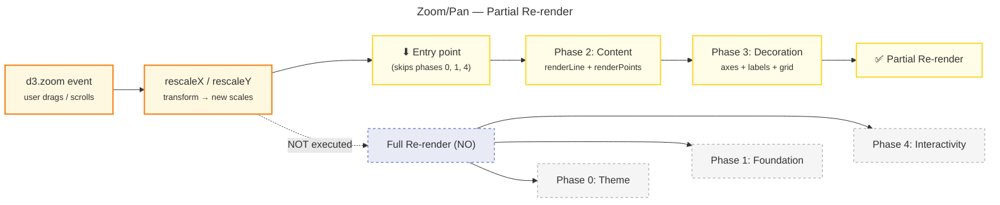

# visc-line: Specifications & Design Decisions

## Purpose

A line chart component library built on D3.js. It abstracts D3's complexity behind a declarative, fluent API, enabling configurable line charts through a CSS custom properties-based theming system.

---

## 1. General Architecture

### 1.1 Layer Organization

The library follows a **layered architecture** where each layer has clear responsibilities:

| Layer | Responsibility | Location |
|-------|---------------|----------|
| **Public API** | Builder pattern with fluent methods | `chart/` |
| **Orchestration** | Coordinate rendering, state, and lifecycle | `chart/` |
| **Rendering** | Create/update SVG elements | `components/` |
| **Transformation** | Data → scales, layout, processing | `services/` |
| **Interactivity** | Tooltip, zoom/pan (side effects) | `interactivity/` |
| **Theme** | Visual tokens and CSS custom properties | `themes/` |
| **Types** | TypeScript interfaces | `types/` |
| **Utilities** | Reusable helper functions | `utils/` |

### 1.2 Decision: Builder Pattern + Centralized Render Loop

**Chosen approach**: `createChart()` returns an instance with fluent methods (`.withAxes()`, `.withTooltip()`, etc.) that mutate internal state and trigger a re-render.

**Alternative considered**: Composing renderers directly.

**Rationale**:
- Enables incremental, readable configuration
- Centralized state simplifies idempotency
- Automatic re-render after each `.with*()` call simplifies usage

**Trade-off**: State mutation can make debugging harder; mitigated by typed `ChartState`.

### 1.3 Decision: Procedural Rendering with D3 Upsert

**Chosen approach**: Each component is a pure function that receives state and performs direct DOM manipulation via D3.

**Alternative considered**: Virtual DOM or declarative reconciler.

**Rationale**: D3 already has an optimized enter/update/exit model for SVG. Wrapping D3's reconciler would add complexity without benefit.

---

## 2. Render Flow (Fixed Sequence)

Rendering follows a **mandatory sequence**. Reordering or skipping steps breaks dimensions because each step depends on the DOM created by the previous step (SVG → bounds → content → elements inside content).

### 2.1 Full Render Cycle

```mermaid
---
title: Render Cycle — visc-line
---
flowchart TB
    %% ---- Classes ----
    classDef trigger fill:#e8eaf6,stroke:#3f51b5,stroke-width:2px
    classDef pre fill:#fff3e0,stroke:#fb8c00,stroke-width:2px
    classDef foundation fill:#e3f2fd,stroke:#1e88e5,stroke-width:2px
    classDef core fill:#e8f5e9,stroke:#43a047,stroke-width:2px
    classDef decor fill:#f3e5f5,stroke:#8e24aa,stroke-width:2px
    classDef interact fill:#fce4ec,stroke:#e53935,stroke-width:2px
    classDef decision fill:#f5f5f5,stroke:#9e9e9e,stroke-width:1px,stroke-dasharray: 4
    classDef cleanup fill:#ffebee,stroke:#d32f2f,stroke-width:1px
    classDef partial fill:#fffde7,stroke:#fdd835,stroke-width:2px,stroke-dasharray: 6 3
    classDef zoomEvent fill:#fff8e1,stroke:#f57f17,stroke-width:2px

    %% ---- Entry points ----
    TRIGGER{"What triggers the render?"}:::trigger

    INIT["createChart() initial"]:::trigger
    WITH[".with*() method called"]:::trigger
    RESIZE["ResizeObserver fires"]:::trigger

    TRIGGER --> INIT
    TRIGGER --> WITH
    TRIGGER --> RESIZE

    INIT -->|"PATH A: FULL RE-RENDER"| CLEANUP
    WITH --->|"PATH A: FULL RE-RENDER"| CLEANUP
    RESIZE --->|"PATH A: FULL RE-RENDER"| CLEANUP

    CLEANUP["clearOptionalNodes()<br/><small>Removes DOM of features<br/>that are no longer active</small>"]:::cleanup

    %% ---- PHASE 0: Theme ----
    subgraph PHASE0["PHASE 0 — Theme (before SVG)"]
        direction TB
        THEME["applyThemeCssVars(container, resolvedTheme)<br/><small>Writes --vl-* vars on container</small>"]:::pre
    end

    CLEANUP --> THEME

    %% ---- PHASE 1: Foundation ----
    subgraph PHASE1["PHASE 1 — SVG Foundation"]
        direction TB
        SVG["renderSVG(container)<br/><small>Creates/updates &lt;svg&gt;<br/>Container dimensions</small>"]:::foundation
        BOUNDS["renderBoundsGroup(svg, margins)<br/><small>Creates &lt;g class='bounds'&gt;<br/>translate(marginLeft, marginTop)</small>"]:::foundation
        CONTENT["renderContentGroup(bounds, svg, clipPath)<br/><small>Creates &lt;g class='content'&gt;<br/>with &lt;clipPath&gt; applied</small>"]:::foundation
    end

    THEME --> SVG --> BOUNDS --> CONTENT

    %% ---- Partial re-render entry point for zoom ----
    ZOOM_ENTRY["⬇︎ Partial re-render<br/>entry point"]:::partial

    %% ---- PHASE 2: Content ----
    subgraph PHASE2["PHASE 2 — Content (inside content)"]
        LINE["renderLine(content, series, scales)<br/><small>&lt;path&gt; per series<br/>d3.line().curve()</small>"]:::core
        POINTS_GATE{"hasPoints?"}:::decision
        POINTS["renderPoints(content, series, scales)<br/><small>&lt;circle&gt; per point</small>"]:::core
    end

    CONTENT --> LINE
    ZOOM_ENTRY --> LINE
    LINE --> POINTS_GATE
    POINTS_GATE -->|Yes| POINTS
    POINTS_GATE -->|No| SKIP_POINTS

    SKIP_POINTS["Skipped"]:::decision

    %% ---- PHASE 3: Decoration ----
    subgraph PHASE3["PHASE 3 — Decoration (svg and bounds)"]
        TITLE_GATE{"hasTitle?"}:::decision
        TITLE["renderTitle(svg, options)<br/><small>&lt;text class='chart-title'&gt;</small>"]:::decor
        XAXIS_GATE{"hasAxes?"}:::decision
        XAXIS["renderXAxis(bounds)<br/><small>D3 axisBottom</small>"]:::decor
        YAXIS["renderYAxis(bounds)<br/><small>D3 axisLeft</small>"]:::decor
        XLABEL_GATE{"xLabel?"}:::decision
        YLABEL_GATE{"yLabel?"}:::decision
        XLABEL["renderXAxisLabel(svg)"]:::decor
        YLABEL["renderYAxisLabel(svg)"]:::decor
        GRID_GATE{"hasGrid?"}:::decision
        XGRID["renderXGrid(content)<br/><small>&lt;line class='grid-x'&gt;</small>"]:::decor
        YGRID["renderYGrid(content)<br/><small>&lt;line class='grid-y'&gt;</small>"]:::decor
    end

    POINTS --> TITLE_GATE
    SKIP_POINTS --> TITLE_GATE
    TITLE_GATE -->|Yes| TITLE
    TITLE_GATE -->|No| SKIP_TITLE
    TITLE --> XAXIS_GATE
    SKIP_TITLE["Skipped"]:::decision --> XAXIS_GATE
    XAXIS_GATE -->|Yes| XAXIS
    XAXIS_GATE -->|No| SKIP_AXES
    XAXIS --> YAXIS
    YAXIS --> XLABEL_GATE
    SKIP_AXES["Skipped"]:::decision --> GRID_GATE
    XLABEL_GATE -->|Yes| XLABEL
    XLABEL_GATE -->|No| SKIP_XLABEL
    XLABEL --> YLABEL_GATE
    SKIP_XLABEL["Skipped"]:::decision --> YLABEL_GATE
    YLABEL_GATE -->|Yes| YLABEL
    YLABEL_GATE -->|No| SKIP_YLABEL
    YLABEL --> GRID_GATE
    SKIP_YLABEL["Skipped"]:::decision --> GRID_GATE
    GRID_GATE -->|Yes| XGRID
    GRID_GATE -->|No| SKIP_GRID
    XGRID --> YGRID
    YGRID --> INTERACT_CHECK
    SKIP_GRID["Skipped"]:::decision --> INTERACT_CHECK

    %% ---- Post-render checkpoint ----
    INTERACT_CHECK["Interactivity<br/>already set up"]:::decision

    %% ---- PHASE 4: Interactivity ----
    subgraph PHASE4["PHASE 4 — Interactivity (post-render, one-time setup)"]
        TOOLTIP_GATE{"hasTooltip?"}:::decision
        TOOLTIP["addTooltip(bounds)<br/><small>tipviz + cursor + dots</small>"]:::interact
        ZOOM_GATE{"hasZoomPan?"}:::decision
        ZOOM["addZoomPan(svg)<br/><small>Configures d3.zoom<br/>Does NOT render yet</small>"]:::interact
        ZOOM_REGION["<b>⚠ DURING ZOOM (event)</b>"]:::zoomEvent
        RESCALE["rescaleX / rescaleY<br/><small>New scales from<br/>d3.event.transform</small>"]:::zoomEvent
        PARTIAL["Partial re-render<br/><small>PHASES 2 + 3 (CONTENT + DECORATION)<br/>no cleanup, theme, or foundation</small>"]:::partial
    end

    YGRID --> INTERACT_CHECK
    INTERACT_CHECK -->|initial setup| TOOLTIP_GATE
    TOOLTIP_GATE -->|Yes| TOOLTIP
    TOOLTIP_GATE -->|No| SKIP_TT
    TOOLTIP --> ZOOM_GATE
    SKIP_TT["Skipped"]:::decision --> ZOOM_GATE
    ZOOM_GATE -->|Yes| ZOOM
    ZOOM_GATE -->|No| DONE
    ZOOM --> DONE

    %% ---- Zoom cycle (runtime event) ----
    ZOOM -.->|"user zooms →<br/>fires event"| ZOOM_REGION
    ZOOM_REGION --> RESCALE
    RESCALE --> PARTIAL
    PARTIAL -.->|"enters PHASE 2 directly"| ZOOM_ENTRY

    DONE["✅ Render Complete"]:::trigger
    DONE_PARTIAL["✅ Partial Re-render<br/>Complete"]:::partial

    YGRID --> DONE_PARTIAL

    %% ---- Design notes ----
    N1["🧠 ClipPath on content, NOT on bounds<br/>Axes remain outside the clip<br/>→ visible during zoom/pan"]:::decision
    N2["🧠 Every renderer is idempotent<br/>D3 .data().join() upsert<br/>→ same data = same DOM"]:::decision
    N3["🧠 Zoom does NOT use full re-render<br/>→ rescales + re-renders content and axes<br/>→ SVG foundation (phase 1) untouched"]:::decision
    N4["🧠 Interactivity is configured ONCE<br/>Subsequent zooms do NOT re-run<br/>addTooltip or addZoomPan"]:::decision

    CONTENT -.- N1
    POINTS -.- N2
    PARTIAL -.- N3
    INTERACT_CHECK -.- N4
```



### 2.2 Cycle Phases

| Phase | Purpose | Contains |
|-------|---------|----------|
| **0. Theme** | Prepare visual context before any DOM | `applyThemeCssVars()` |
| **1. Foundation** | Build structural SVG hierarchy | `renderSVG`, `renderBoundsGroup`, `renderContentGroup` |
| **2. Content** | Render the data visualization (clipped) | `renderLine`, `renderPoints` |
| **3. Decoration** | Add context elements (unclipped) | `renderTitle`, `renderXAxis`, `renderYAxis`, `renderXGrid`, `renderYGrid`, labels |
| **4. Interactivity** | Enable user manipulation | `addTooltip`, `addZoomPan` |

### 2.3 Feature Flags (Render Gates)

Each optional component has a boolean flag in `ChartState`:

| Flag | Renders | Default |
|------|---------|---------|
| `hasTitle` | Title | false |
| `hasAxes` | X + Y axes | false |
| `hasGrid` | X + Y grid | false |
| `hasPoints` | Data points | false |
| `hasTooltip` | Tooltip | false |
| `hasZoomPan` | Zoom/Pan | false |

The flag is activated by calling the corresponding fluent method (`.withTitle()`, `.withAxes()`, etc.).

### 2.4 Decision: ClipPath on Content, Not on Bounds

**Chosen approach**: The `<clipPath>` is applied to the content group (line, points, grid), NOT to the bounds group (axes).

**Rationale**: Axes remain visible during zoom/pan; only the content gets clipped.

### 2.5 Decision: Full Re-render vs. Partial Re-render

**Problem**: Different triggers require different re-render scopes. Not every change needs to rebuild the SVG foundation.

| Trigger | Re-render type | Phases executed |
|---------|---------------|-----------------|
| `createChart()` initial | Full | 0 + 1 + 2 + 3 + 4 |
| `.with*()` (config) | Full | 0 + 1 + 2 + 3 + 4 |
| ResizeObserver | Full | 0 + 1 + 2 + 3 + 4 |
| **Zoom/Pan (runtime event)** | **Partial** | **2 + 3 (skips 0, 1, 4)** |

**Path A — Full re-render** (init, `.with*()`, resize):
1. `clearOptionalNodes()` — cleans up DOM of disabled features
2. `applyThemeCssVars()` — re-writes CSS variables
3. `renderSVG` + `renderBoundsGroup` + `renderContentGroup` — rebuilds foundation
4. `renderLine` + `renderPoints` — renders content
5. `renderTitle`/`renderXAxis`/`renderYAxis`/labels/grid — decoration
6. `addTooltip` + `addZoomPan` — configures interactivity (only the first time via internal flag)

**Path B — Partial re-render** (zoom event):
1. `d3.event.transform.rescaleX/rescaleY` — **new scales** without touching the DOM
2. Enters directly at **Phase 2** (renderLine, renderPoints)
3. Continues through **Phase 3** (axes, labels, grid — with the new scales)
4. **Does not execute** cleanup, theme, foundation, or interactivity

**Rationale**: The SVG foundation (svg, bounds, content, clipPath) does not change during zoom. Only the scales and what depends on them (lines, points, axes, grid) are affected. Avoiding foundation rebuild saves unnecessary work.

**Discarded alternative**: Full re-render on every zoom event.

**Why it was discarded**: Zoom generates dozens of events per second. Re-rendering SVG, bounds, content, cleanup, theme, and interactivity on each frame would introduce perceptible latency. The partial re-render is the only path optimized for real-time interactivity.

**Discarded alternative (for full)**: Re-render only the affected component after a `.with*()` call.

**Why it was discarded**: It is simpler and more predictable to re-render everything. Renderers are fast (D3 upsert with data join) and the cost is negligible for non-continuous triggers.

#### Zoom/Pan Cycle (Partial Re-render)



### 2.6 Decision: ResizeObserver for Re-render

**Chosen approach**: Each chart instance creates a `ResizeObserver` that fires a full re-render when the container size changes.

**Alternative considered**: Manual resize handling.

**Rationale**: The container can change through CSS without the chart knowing; automatic reaction is preferable.

### 2.7 Decision: Cleanup Before Re-render

**Chosen approach**: Before each render, `clearOptionalNodes()` removes the DOM of features that are no longer active.

**Rationale**: If a user calls `.withTitle("Hello")` and later discards the title, the SVG title elements must disappear. Cleanup ensures the DOM exactly reflects the current state.

---

## 3. Idempotent Rendering Pattern

### 3.1 Principle: D3 Upsert Pattern

All renderers use the D3 pattern to avoid duplication:

```typescript
selection
  .selectAll<DOM_ELEMENT, DATA>("css.class")
  .data([null] or dataArray, keyFunction)
  .join(
    (enter) => append,
    (update) => update,
    (exit) => exit.remove()
  )
```

### 3.2 Renderer Classification by Data Type

| Type | Datum | Effect |
|------|-------|--------|
| **Singleton** | `[null]` | Single element always exists (svg, bounds, axes) |
| **Keyed** | `dataArray with key` | Upsert by key (lines per series, points per datum) |
| **Cleanup** | `clearOptionalNodes()` function | Removes DOM of disabled features |

### 3.3 Decision: Select by CSS Class, Not Data Attribute

**Chosen approach**: Renderers select existing elements using CSS class selectors (`.chart-line`, `.x-axis`).

**Alternative considered**: Data attributes or IDs.

**Rationale**: CSS classes are D3's natural mechanism for styling and selection; maintaining them simplifies code and enables CSS-driven selection.

---

## 4. Theme System & CSS Custom Properties

### 4.1 Two-Layer Architecture

```
Theme Object (TypeScript)
    ↓ applyThemeCssVars()
CSS Custom Properties (var(--vl-*))
    ↓ getComputedStyle() when D3 requires numbers
Numeric values for D3 APIs
```

### 4.2 Token to CSS Variable Mapping

| Category | Tokens | CSS Variable |
|----------|--------|--------------|
| Background | `colors.background` | `--vl-background` |
| Palette | `colors.palette[i]` | `--vl-palette-0`, `--vl-palette-1`, ... |
| Line | `line.strokeWidth` | `--vl-line-stroke-width` |
| Points | `points.radius` | `--vl-point-radius` |
| Axes | `axis.fontSize` | `--vl-axis-font-size` |
| Grid | `grid.stroke` | `--vl-grid-stroke` |
| Tooltip | `tooltip.background` | `--vl-tooltip-bg` |

### 4.3 Decision: CSS Variables for Everything, getComputedStyle for D3

**Problem**: `D3 axis.tickSize()` requires a number, not a CSS string.

**Solution**:
1. Renderers use `var(--vl-*)` for SVG attributes (stroke, fill, font-size)
2. For D3 APIs that require numbers, `getComputedStyle(el).getPropertyValue("--vl-*")` retrieves the resolved value

### 4.4 Decision: High Contrast Mode as Inline Override

**Chosen approach**: High contrast mode applies hardcoded values via inline style directly on the container.

**Rationale**: It does not modify the theme or CSS vars; it is a direct override that completely ignores the theme.

---

## 5. DOM Component Hierarchy

### 5.1 Nesting Structure

```
<svg>
  ├── <defs>
  │   └── <clipPath id="visc-clip-{hash}"/>
  ├── <g class="bounds" transform="translate(marginLeft, marginTop)">
  │   ├── <g class="content" clip-path="url(#...)">
  │   │   ├── <path class="chart-line chart-line--{seriesLabel}"/>
  │   │   ├── <g class="point-series point-series--{label}">
  │   │   │   └── <circle class="point"/>
  │   │   └── <line class="grid-x"/> / <line class="grid-y"/>
  │   ├── <g class="x-axis"/>
  │   ├── <g class="y-axis"/>
  │   ├── <line class="tooltip-cursor"/>
  │   ├── <circle class="tooltip-dot"/>
  │   └── <rect class="mouse-capture"/>
  ├── <text class="chart-title"/>
  ├── <text class="x-axis-label"/>
  ├── <text class="y-axis-label"/>
  ├── <g class="legend">
  │   └── <g class="legend-entry">
  │       ├── <rect class="swatch"/>
  │       └── <text class="legend-label"/>
  └── {tip-viz-tooltip element}
```

### 5.2 Render Responsibility Matrix

| Component | Renders into | File |
|-----------|-------------|------|
| SVG | container | SVG.mts |
| Bounds Group | svg | boundsGroup.mts |
| Content Group | bounds | contentGroup.mts |
| Line | content | line.mts |
| Points | content | points.mts |
| Title | svg | title.mts |
| X Axis | bounds | xAxis.mts |
| Y Axis | bounds | yAxis.mts |
| Axis Labels | svg | axisLabel.mts |
| Grid | content | grid.mts |
| Legend | svg | legend.mts |
| Tooltip | bounds | tooltip.mts |
| Zoom/Pan | svg | zoomPan.mts |

---

## 6. Data Flow

### 6.1 Transformation Pipeline

```
Raw data (T[])
    ↓ ChartConfig { data, xSerie, ySeries[] }
    ↓ processAllSeries()
ProcessedSeries<T>[] { filtered data, series descriptor }
    ↓ getMultiSeriesExtents()
{ xDomain, yDomain }
    ↓ createScales()
{ xScale, yScale }
    ↓ renderers
SVG Elements
```

### 6.2 Data Validation

**Step**: `processAllSeries()` filters invalid values:
- `null`, `undefined`
- `NaN`
- `Infinity` / `-Infinity`

**Rationale**: D3 does not handle these values gracefully; filtering prevents silent errors or unexpected behavior.

### 6.3 Domain Calculation

**Chosen approach**: The domain is calculated with `d3.extent()` across all series data, not per individual series.

**Alternative considered**: Per-series domain.

**Rationale**: For multiple series, a shared domain ensures all series are comparable on the same scale.

---

## 7. Type System

### 7.1 Main Types

| Type | Purpose |
|------|---------|
| `ChartConfig<T>` | Input: data + x/y series definitions |
| `ProcessedSeries<T>` | Series with filtered data |
| `SeriesDescriptor<T>` | Accessor + label + style overrides |
| `ChartInstance<T>` | Public API returned by createChart |
| `ChartOptions` | Creation options (curve, margins, theme, scale types) |
| `WithAxesOptions` | Tick count and format configuration |
| `WithGridOptions` | showX/showY flags |
| `WithTooltipOptions` | formatX/Y, tooltipHtml, stylesheetUrl |
| `WithZoomPanOptions` | onZoom callback, scaleExtent |
| `WithTitleOptions` | title string |
| `WithLegendOptions` | legend items |
| `Theme` | Complete theme object |
| `ThemeOverride` | Deep partial of Theme for overrides |
| `Dimensions` | width, height, innerWidth, innerHeight, margins |
| `Margins` | top, right, bottom, left |
| `AnyScale` | Union of D3 scale types |
| `TickableScale` | Minimum contract for axes/grid (domain, ticks) |
| `ScaleType` | "linear" \| "log" \| "pow" \| "time" |
| `CustomContext` | Escape hatch: context for arbitrary callbacks |
| `CurvePreset` | 18 curve presets as string literals |

### 7.2 Type Relationships

```
ChartConfig<T>
    ↓ processAllSeries()
ProcessedSeries<T>[]
    ↓ ChartState (internal state)
    ↓ + feature flags
RenderContext<T>
    ↓ passed to each renderer
```

---

## 8. Configurable vs. Hardcoded Aspects

### 8.1 Configurable Aspects

| Aspect | Configuration Mechanism |
|--------|------------------------|
| Data | `ChartConfig<T>` with accessors |
| Curve | `curve: CurveFactory \| CurvePreset` |
| Margins | `margins?: Margins` (default predefined) |
| X scale type | `xType?: ScaleType` (default: "time") |
| Theme | `theme?: ThemeOverride` (deep-merge) |
| Axis ticks | via `.withAxes()` |
| Grid | showX/showY flags via `.withGrid()` |
| Points | Enabled via `.withPoints()` |
| Title | string via `.withTitle()` |
| Legend | items via `.withLegend()` |
| Tooltip | options via `.withTooltip()` |
| Zoom/Pan | options via `.withZoomPan()` |
| Custom | arbitrary callbacks via `.withCustom()` |

### 8.2 Hardcoded Aspects

| Aspect | Value |
|--------|-------|
| Default margins | 50/55/60/70 (top/left/right/bottom) |
| Legend position | Hardcoded offset and width |
| ClipPath | Always applied to content group |
| Animation duration | 1000ms |
| Default zoom scaleExtent | [0.5, 32] |
| Default D3 axis tick count | 5 |
| High contrast | Hardcoded black values |

---

## 9. Consolidated Design Decisions

### 9.1 API

- **Builder pattern** with fluent methods for incremental configuration
- **Feature flags** in ChartState for conditional render gating
- **Custom callbacks** as an escape hatch for advanced customization

### 9.2 Rendering

- **Centralized render loop** in `chartRender.mts`
- **Mandatory fixed sequence** of render steps
- **D3 upsert** (enter/update/exit) for idempotency
- **CSS class selection** to find existing nodes

### 9.3 Theming

- **Theme object** → **CSS custom properties** → **getComputedStyle for D3**
- **Deep merge** of overrides on top of the default theme
- **High contrast** as an independent inline override

### 9.4 Data

- **Validation** filtering null, NaN, Infinity before rendering
- **Shared domain** across series for uniform scaling
- **Configurable accessors** for x/y instead of fixed paths

### 9.5 Interactivity

- **ResizeObserver** for automatic re-render on resize
- **Zoom/Pan** as scale transformation (not SVG viewBox)
- **Tooltip** with cursor line and per-series dots

---

## 10. Naming Conventions

### 10.1 Functions and Files

| Convention | Example |
|-----------|---------|
| camelCase | `renderLine`, `applyThemeCssVars` |
| PascalCase | `ChartInstance`, `ProcessedSeries` |
| UPPER_SNAKE_CASE | `DEFAULT_MARGINS`, `CURVE_PRESETS` |
| Boolean prefixes | `is`, `has`, `can`, `should` |

### 10.2 CSS Classes

```
chart-line           → line base class
chart-line--{label}  → modifier per series
point-series         → point group
point-series--{label} → per series
x-axis               → X axis
y-axis               → Y axis
grid-x / grid-y      → grid lines
tooltip-cursor       → vertical tooltip line
tooltip-dot          → per-series dots in tooltip
legend-entry         → legend entry
swatch               → legend color rectangle
legend-label         → legend text
chart-title          → chart title
x-axis-label         → X axis label
y-axis-label         → Y axis label
mouse-capture        → invisible rect for mouse event capture
```

---

## 11. Dependencies

### 11.1 Peer Dependencies

| Dependency | Version | Role |
|-----------|---------|------|
| `d3` | `^7.9.0` | Scales, axes, line generator, zoom, pointer, bisector |
| `tipviz` | `^2.3.1` | Tooltip rendering |

### 11.2 Bundling

| Dependency | Bundled? | Reason |
|-----------|----------|--------|
| `tipviz` | Yes (forced) | Required in the UMD bundle for standalone use |
| `d3` | No (external) | Expected as a UMD global from the consumer |

### 11.3 Platform

**Browser-only** with UMD output. No Node.js or SSR support.

---

## 12. Testing

- **Framework**: Vitest with jsdom environment
- **File pattern**: `src/**/*.test.mts`
- **Coverage**: v8 provider, text/json/html reporters
- **Command order**: `type-check → test → build`

---

## 13. Key Abstraction Glossary

| Term | Definition |
|------|------------|
| **ChartInstance** | Instance returned by createChart; exposed to the user |
| **ChartState** | Mutable internal state; feature flags + processed data |
| **ChartConfig** | User-provided input configuration |
| **ProcessedSeries** | Series with invalid values filtered out |
| **RenderContext** | State + config + scales shared across renderers |
| **CustomContext** | Escape hatch: access to bounds, content, dims, scales |
| **Feature Flag** | Boolean that gates which renderers execute |
| **CurvePreset** | String literal mapped to a D3 CurveFactory |
| **ScaleType** | D3 scale type: linear, log, pow, time |
| **Idempotent** | Rendering twice with the same data produces identical DOM |
| **D3 Upsert** | Enter/update/exit pattern to create/update/remove elements |
