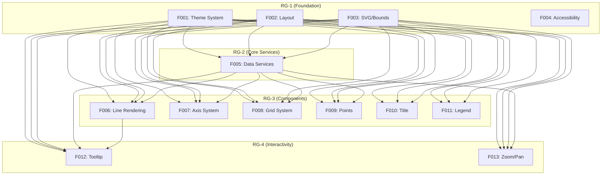

# Roadmap — visc-line

> Global Evolution Layer for visc-line D3.js line chart library.
> Generated by `/reverse-spec` Phase 4-1.

## Project Overview

**Project Name**: visc-line
**Type**: Browser-only TypeScript library for rendering D3.js line charts
**Core Functionality**: Component functions that render customizable line charts with axes, titles, legends, tooltips, and zoom/pan interactivity
**Target Users**: Developers building data visualization applications

## Rebuild Strategy

Since this is a **Same Stack rebuild** (TypeScript + D3.js), the library's existing architecture will be preserved with improved type safety and enhanced test coverage.

**Key Architectural Decisions**:
- Keep functional rendering pattern (idempotent DOM manipulation via D3)
- Preserve CSS variable theming system
- Maintain curve preset system for line interpolation
- Keep chart factory pattern (createChart with fluent API)

## Feature Catalog

| ID | Feature Name | Description | RG | Dependencies |
|----|--------------|-------------|----|--------------|
| F001 | Theme System | Theme management, CSS variables, curve presets | RG-1 | None |
| F002 | Layout | Layout and margin calculations | RG-1 | None |
| F003 | SVG/Bounds | SVG root and bounds group rendering | RG-1 | None |
| F004 | Accessibility | Resize observation and responsiveness | RG-1 | None |
| F005 | Data Services | Data wrangling, scales computation, extent caching | RG-2 | F001, F002 |
| F006 | Line Rendering | Line drawing with curve interpolation | RG-3 | F001, F002, F003, F005 |
| F007 | Axis System | X and Y axis rendering with labels | RG-3 | F001, F002, F003, F005 |
| F008 | Grid System | X and Y grid rendering | RG-3 | F001, F002, F003, F005 |
| F009 | Points | Data point rendering | RG-3 | F001, F002, F003, F005 |
| F010 | Title | Chart title rendering | RG-3 | F001, F002, F003 |
| F011 | Legend | Legend rendering | RG-3 | F001, F002, F003 |
| F012 | Tooltip | Interactive tooltip display on hover | RG-4 | F001, F002, F003, F005, F006 |
| F013 | Zoom/Pan | Interactive zoom and pan via D3 zoom | RG-4 | F001, F002, F003, F005 |

## Dependency Graph

## Release Groups

| Release Group | Features | Description |
|---------------|----------|-------------|
| RG-1 (Foundation) | F001, F002, F003, F004 | Core infrastructure: themes, layout, SVG, accessibility |
| RG-2 (Core Services) | F005 | Data processing: scales, data wrangling, extents |
| RG-3 (Components) | F006, F007, F008, F009, F010, F011 | Visual components: line, axes, grid, points, title, legend |
| RG-4 (Interactivity) | F012, F013 | Interactive features: tooltip, zoom/pan |

## Demo Groups

### DG-01: Basic Line Chart

**Scenario**: Render a basic line chart with all standard features

**Features**: F001 (Theme), F002 (Layout), F003 (SVG/Bounds), F004 (Accessibility), F005 (Data Services), F006 (Line), F007 (Axes), F008 (Grid), F009 (Points), F010 (Title), F011 (Legend), F012 (Tooltip), F013 (Zoom/Pan)

**SBI Coverage**: B001–B019

**User Flow**:
1. Create chart container with data configuration
2. Configure axes, grid, and legend
3. Add optional title and points
4. Enable tooltip and zoom/pan interactivity
5. Update data dynamically

## Cross-Feature Entity Dependencies

| Entity | Owner Feature | Consumers |
|--------|---------------|-----------|
| ChartConfig<T> | F005 (Data Services) | All Features |
| ProcessedSeries<T> | F005 (Data Services) | F006, F007, F008, F009 |
| Theme | F001 (Theme System) | All Features |
| ChartState<T> | F003 (SVG/Bounds) | F012, F013 |
| ChartScales | F005 (Data Services) | F006, F007, F008, F009 |

## Cross-Feature API Dependencies

| API | Provider | Consumers |
|-----|----------|-----------|
| createChart() | Chart Core | External consumers |
| mergeTheme() | F001 (Theme System) | F001, F002, F003 |
| applyThemeCssVars() | F001 (Theme System) | F001, F003 |
| createScales() | F005 (Data Services) | F006, F007, F008, F009 |
| getMultiSeriesExtents() | F005 (Data Services) | F007, F008 |
| processAllSeries() | F005 (Data Services) | Chart Core |
